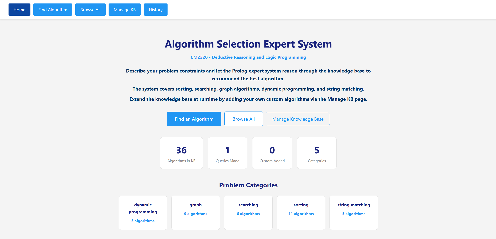
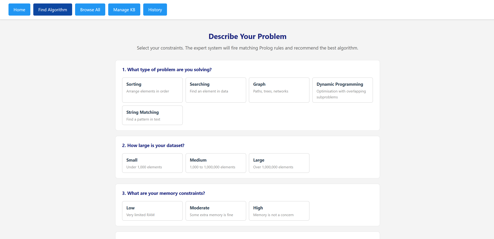
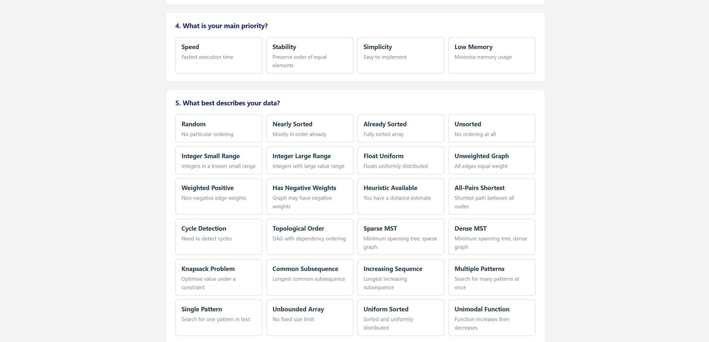
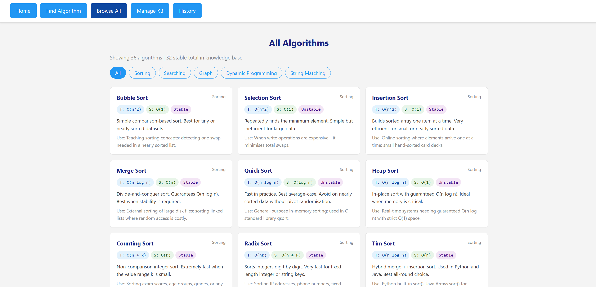

# Algorithm Selection Expert System (Prolog-based Web Application)

This is a web-based Algorithm Selection Expert System developed using SWI-Prolog. It uses a rule-based expert system to recommend the most suitable algorithm for a given problem based on problem type, data size, memory constraints, and priorities — with full dynamic knowledge base management.

## 🔧 Features

- 🧠 **Intelligent Recommendation**: The Prolog expert system reasons through rules to recommend the best algorithm for your constraints.
- 📊 **Complexity Analysis**: Every recommendation includes time complexity, space complexity, and stability.
- 💡 **Rich Explanations**: Understand why the algorithm was chosen, its real-world use cases, and when to avoid it.
- 🔄 **Alternative Suggestions**: The system always recommends an alternative algorithm.
- 🗄️ **Dynamic Knowledge Base**: Add or remove algorithms at runtime using `assertz/1` and `retract/1` through the Manage KB page.
- 📚 **Browse All Algorithms**: Explore all algorithms filterable by category.
- 📜 **Query History**: All queries are stored dynamically using `assertz/1` and grouped using `bagof/3`.

---

## 📁 Project Structure

| File | Description |
|---|---|
| `web_interface.pl` | Main file — HTTP server, all page handlers, dynamic KB management |
| `algorithms.pl` | Knowledge base — 36 algorithms declared with `:- dynamic algorithm/6` |
| `rules.pl` | Recommendation rules + helpers using `findall/3`, `bagof/3`, `member/2`, `forall/2` |
| `complexity.pl` | `use_case/2` and `avoid_when/2` facts for every algorithm |
| `query_log.pl` | Dynamic declarations: `query_log/7` and `custom_algorithm/6` |

---

## ✅ CM2520 Requirements Coverage

| Requirement | How it is met |
|---|---|
| **Facts & Rules** | `algorithm/6` facts in `algorithms.pl`; `recommend/6` rules in `rules.pl` with cuts (`!`) and conditionals (`-> ;`) |
| **Dynamic KB** | `assertz/1` adds custom algorithms and logs queries; `retract/1` removes custom algorithms; `retractall/1` clears history |
| **Web Interface** | SWI-Prolog HTTP server serving 5 pages; Manage KB page for runtime add/remove |
| **findall/3** | Used in `result_page` to count algorithms per category; in `browse_page` to collect all matching algorithms |
| **bagof/3** | Used in `all_stable_algorithms/1` and `history_page` to group queries by problem type |
| **member/2** | Used in `all_inplace_algorithms/1` to filter algorithms by space complexity from a list |
| **forall/2** | Used in `all_exist/1` to verify every algorithm in a list exists in the KB |
| **\+ (negation)** | Used in `add_algorithm/6` to prevent duplicate entries; in `rules.pl` for constraint filtering |
| **Backtracking** | Rules use multiple clauses — Prolog backtracks through `recommend/6` clauses until a match is found |

---

## 🧠 Algorithms in the Knowledge Base

| Category | Count | Examples |
|---|---|---|
| Sorting | 11 | Bubble, Merge, Quick, Heap, Tim, Counting, Radix... |
| Searching | 6 | Binary, Linear, Jump, Interpolation, Exponential... |
| Graph | 9 | BFS, DFS, Dijkstra, A\*, Bellman-Ford, Kruskal... |
| Dynamic Programming | 5 | Memoization, Tabulation, Knapsack DP, LCS, LIS |
| String Matching | 5 | KMP, Boyer-Moore, Rabin-Karp, Z-Algorithm, Naive |

---

## 🔬 Example Prolog Rules

```prolog
% Negative weights — only Bellman-Ford is correct
recommend(graph, _, _, _, weighted_negative, bellman_ford) :- !.

% Memory tight — heap sort is the only O(1) space O(n log n) sort
recommend(sorting, _, low, _, _, heap_sort) :- !.

% Collect all algorithms in a category using findall/3
all_in_category(Category, List) :-
    findall(Name, algorithm(Name, Category, _, _, _, _), List).

% Group stable algorithms using bagof/3
all_stable_algorithms(StableList) :-
    bagof(Name-Cat,
          Time^Space^Desc^algorithm(Name, Cat, Time, Space, stable, Desc),
          StableList).

% Add algorithm to live KB using assertz/1
add_algorithm(Name, Cat, Time, Space, Stab, Desc) :-
    \+ algorithm(Name, _, _, _, _, _),
    assertz(algorithm(Name, Cat, Time, Space, Stab, Desc)),
    assertz(custom_algorithm(Name, Cat, Time, Space, Stab, Desc)).
```

---

## 🚀 Getting Started

### 🛠 Prerequisites

- Install [SWI-Prolog](https://www.swi-prolog.org/Download.html) on your system.

### ▶️ Running the Application

1. Open your terminal or command prompt.
2. Navigate to the directory containing the Prolog files.
3. Run the following command:

   ```bash
   swipl -s web_interface.pl
   ```

4. Once the server has started, open your web browser and go to:

   ```
   http://localhost:8080/
   ```

---

## 🤖 UI





