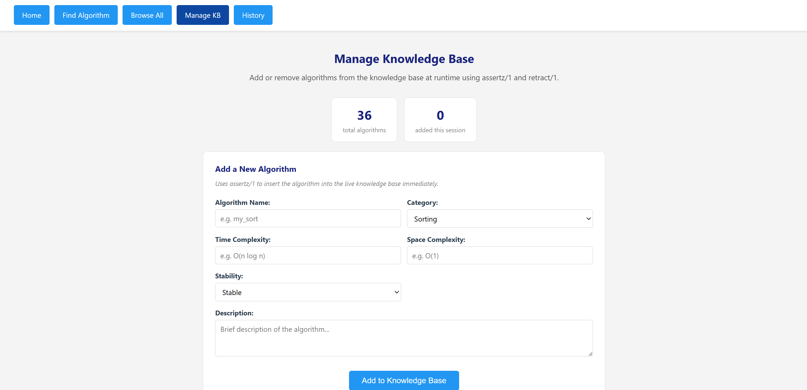

# Algorithm Selection Expert System
### Prolog-based Web Application | CM2520 - Deductive Reasoning and Logic Programming

A web-based expert system developed using SWI-Prolog that recommends the most suitable algorithm for a given problem. The system reasons through a Prolog knowledge base using facts, rules, recursion, and dynamic knowledge base management to produce a ranked recommendation with full explanation.

---

## Features

- **Intelligent Recommendation** — Describe your problem type, data size, memory constraints, and priorities. The expert system fires matching Prolog rules and recommends the best algorithm.
- **Ranked Comparison Table** — The result page uses recursive scoring to rank all algorithms in the selected category against your constraints and displays a comparison table.
- **Complexity Analysis** — Every recommendation includes time complexity, space complexity, and stability classification.
- **Detailed Explanations** — Each result shows why the algorithm was chosen, real-world use cases, and when to avoid it.
- **Alternative Suggestion** — The system always recommends a second algorithm to consider.
- **Dynamic Knowledge Base** — Add or remove custom algorithms at runtime through the Manage KB page using `assertz/1` and `retract/1`.
- **Browse All Algorithms** — Explore all 36 built-in algorithms filterable by category.
- **Query History** — All queries are stored dynamically and grouped using `bagof/3`.

---

## Project Structure

| File | Description |
|---|---|
| `web_interface.pl` | Main entry point — HTTP server, all 6 page handlers, dynamic KB management |
| `algorithms.pl` | Knowledge base — 36 `algorithm/6` facts declared with `:- dynamic` |
| `rules.pl` | Recommendation rules + 4 recursive predicates + helper predicates |
| `complexity.pl` | `use_case/2` and `avoid_when/2` facts for every algorithm |
| `query_log.pl` | Dynamic declarations: `query_log/7` and `custom_algorithm/6` |

---

## Requirements Coverage

| Requirement | How it is met |
|---|---|
| **Facts & Rules** | 36 `algorithm/6` facts in `algorithms.pl`; 44 `recommend/6` rules in `rules.pl` using cuts (`!`) and if-then-else (`-> ;`) |
| **Dynamic Knowledge Base** | `assertz/1` adds custom algorithms and logs every query; `retract/1` removes custom algorithms; `retractall/1` clears history — all via the live Manage KB page |
| **Web Interface** | SWI-Prolog HTTP server serving 6 pages with full HTML/CSS |
| **Recursion** | 4 explicit recursive predicates in `rules.pl` — `score_all/6`, `collect_warnings/2`, `filter_by_score/3`, `build_comparison/3` |
| **findall/3** | Used to collect algorithms by category, build browse lists, count stats |
| **bagof/3** | Used to group stable algorithms and group history queries by problem type |
| **member/2** | Used to filter in-place algorithms from a list by space complexity |
| **forall/2** | Used in `all_exist/1` to verify a list of algorithms all exist in the KB |
| **`\+` negation** | Used to prevent duplicate entries in `add_algorithm/6` and filter non-quadratic algorithms |
| **Backtracking** | `recommend/6` has multiple clauses — Prolog backtracks through them until a match fires |

---

## Algorithms in the Knowledge Base

| Category | Count | Algorithms |
|---|---|---|
| Sorting | 11 | Bubble, Selection, Insertion, Merge, Quick, Heap, Counting, Radix, Tim, Shell, Bucket |
| Searching | 6 | Linear, Binary, Jump, Interpolation, Exponential, Ternary |
| Graph | 9 | BFS, DFS, Dijkstra, A\*, Bellman-Ford, Floyd-Warshall, Kruskal, Prim, Topological Sort |
| Dynamic Programming | 5 | Memoization, Tabulation, Knapsack DP, LCS DP, LIS DP |
| String Matching | 5 | Naive, KMP, Rabin-Karp, Boyer-Moore, Z-Algorithm |

---

## How the Rules Work

The expert system selects an algorithm by matching five inputs against ordered Prolog rules:

| Input | Options |
|---|---|
| Problem Type | `sorting`, `searching`, `graph`, `dynamic_programming`, `string_matching` |
| Data Size | `small`, `medium`, `large` |
| Memory | `low`, `moderate`, `high` |
| Priority | `speed`, `stability`, `simplicity`, `memory` |
| Data Characteristics | `random`, `nearly_sorted`, `unweighted`, `weighted_negative`, `knapsack`, ... (24 options) |

**Example rules:**

```prolog
% Nearly sorted — insertion sort is provably optimal
recommend(sorting, _, _, _, nearly_sorted, insertion_sort) :- !.

% Memory is critical — heap sort is the only O(1) space O(n log n) sort
recommend(sorting, _, low, _, _, heap_sort) :- !.

% Negative weights — Bellman-Ford is the only correct option
recommend(graph, _, _, _, weighted_negative, bellman_ford) :- !.
```

---

## How Recursion Works

After the primary recommendation is made, the system uses four chained recursive predicates to produce the ranked comparison table:

```prolog
% 1. score_all/6 — recursively scores every algorithm in the category
score_all([], _, _, _, _, []).
score_all([Algo|Rest], DS, Mem, Pri, DO, [Score-Algo|ScoredRest]) :-
    score_algorithm(Algo, DS, Mem, Pri, DO, Score),
    score_all(Rest, DS, Mem, Pri, DO, ScoredRest).

% 2. collect_warnings/2 — recursively gathers avoid_when/2 facts
collect_warnings([], []).
collect_warnings([Algo|Rest], [Algo-Warning|More]) :-
    avoid_when(Algo, Warning), !,
    collect_warnings(Rest, More).
collect_warnings([_|Rest], Warnings) :-
    collect_warnings(Rest, Warnings).

% 3. filter_by_score/3 — recursively keeps entries above a threshold
filter_by_score([], _, []).
filter_by_score([Score-Algo|Rest], Threshold, [Score-Algo|Kept]) :-
    Score >= Threshold, !,
    filter_by_score(Rest, Threshold, Kept).
filter_by_score([_|Rest], Threshold, Kept) :-
    filter_by_score(Rest, Threshold, Kept).

% 4. build_comparison/3 — recursively builds the table rows (max 5)
build_comparison(_, 0, []) :- !.
build_comparison([], _, []).
build_comparison([_Score-Algo|Rest], Max, [algo(Algo,T,S,St)|More]) :-
    algorithm(Algo, _, T, S, St, _),
    Next is Max - 1,
    build_comparison(Rest, Next, More).
```

These are called in sequence on the result page:

```prolog
rank_algorithms(PT, DS, Mem, Pri, DO, Ranked),
filter_by_score(Ranked, 5, TopCandidates),
build_comparison(TopCandidates, 5, CompList)
```

---

## How the Dynamic Knowledge Base Works

Custom algorithms can be added and removed through the **Manage KB** page at runtime:

```prolog
% Add — uses assertz/1 to insert into the live KB immediately
add_algorithm(Name, Cat, Time, Space, Stab, Desc) :-
    \+ algorithm(Name, _, _, _, _, _),      % prevent duplicates
    assertz(algorithm(Name, Cat, Time, Space, Stab, Desc)),
    assertz(custom_algorithm(Name, Cat, Time, Space, Stab, Desc)).

% Remove — uses retract/1 to delete from the live KB
remove_algorithm(Name) :-
    custom_algorithm(Name, Cat, Time, Space, Stab, Desc),
    retract(algorithm(Name, Cat, Time, Space, Stab, Desc)),
    retract(custom_algorithm(Name, Cat, Time, Space, Stab, Desc)).

% Every query is logged dynamically
save_query(ID, PT, DS, Mem, Pri, DO, Algo) :-
    assertz(query_log(ID, PT, DS, Mem, Pri, DO, Algo)).
```

---

## Getting Started

### Prerequisites

- Install [SWI-Prolog](https://www.swi-prolog.org/Download.html) on your system.

### Running the Application

1. Open your terminal or command prompt.
2. Navigate to the directory containing the Prolog files.
3. Run the following command:

   ```bash
   swipl -s web_interface.pl
   ```

4. Once the server has started, open your web browser and go to:

   ```
   http://localhost:8080/
   ```

---

## UI



